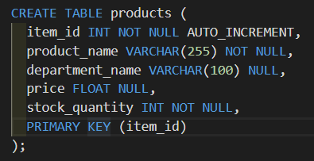

# BAM-azon!
The objective of this programming exercise is to create a set of apps that simulate a storefront by utilizing a MySQL database to house product information and using NODE to handle the exchange of data information.  The customer app allows the user to browse through a list of products, choose a product (by ID) while the manager app allows the user to view the catalogue, add new products, add inventory to existing products and check to see which products have low inventory (threshhold of 5 units).

## Installation
```
npm install
```
#### Dependancies Installed
* [inquirer](https://www.npmjs.com/package/inquirer)
* [mysql](https://www.npmjs.com/package/mysql)

## Instructions
You must have node installed on your system and then you can access the apps through a CLI.

Customer app can be run with:
```
node bamazonCustomer.js
```
Manager app can be run with:
```
node bamazonManager.js
```
### Database
Utilizing a simple MySQL database to store product information... the table was setup as such:



### [Customer Demo Video](https://www.youtube.com/watch?v=9Uod0ZTNoZ8)
### [Manager Demo Video](https://www.youtube.com/watch?v=_20_2WhZ2YY)